### ТЕСТОВОЕ ЗАДАНИЕ JAVA DEVELOPER

#### Общее описание

Разработка web приложения для управления рекламными баннерами и категориями. Баннеры и категории можно
создавать, редактировать и удалять. Выборка баннера происходит через стандартный HTTP запрос, с указанием категории в
параметрах запроса.

#### Модель данных

Всего должно быть минимум 3 таблицы: category, banner, requests. Базовый вариант таблиц и связей:

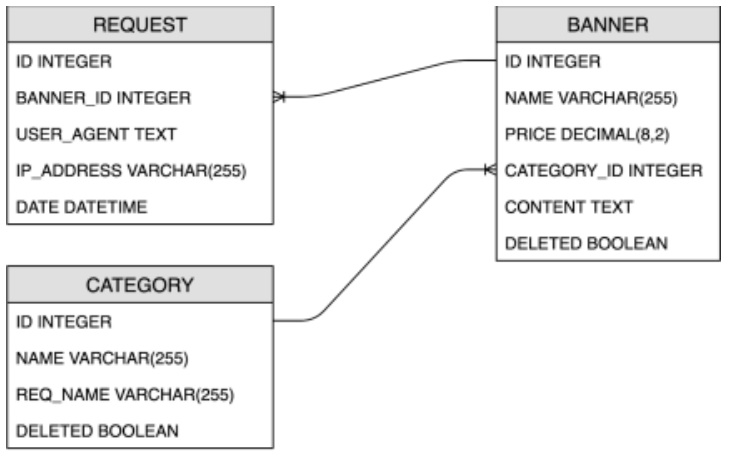

#### Требования к функционалу 

Удаление баннера или категории должно производиться посредством пометки записи как “deleted”.
Все удалённые записи остаются в таблицах, но перестают отображаться на UI.
Удалённые баннеры не показываются в рекламных запросах. 

Категорию нельзя удалить если с ней связаны не удалённые баннеры.
При удалении категории, используемой в каких-либо баннерах, должно показываться сообщение со списком
идентификаторов баннеров, в которых используется категория. 

Для страниц баннера и категории должен работать поиск по имени, то есть, если в поиске написать “ban”,
то на странице должны отображаться только те баннеры и категории, которые содержат этот текст, например,
“firstban” или “somebannner”. Поиск должен игнорировать регистр символов. 

Все данные для создания и редактирования записей должны валидироваться на сервере в соответствии с ограничениями полей
в базе данных. Также все поля в таблицах banner и category должны быть обязательны для заполнения.
 
Имена баннеров должны быть уникальны также как name и req_name в категории.

Если запрос на создание/редактирование/удаление сущности не прошел валидацию, то в нижней части страницы должно выводиться
сообщение об этом. 

Для получения текста баннера используется URL вида: ***http://host:port/bid?category=<REQ_NAME>*** .
В ответ приложение возвращает текст баннера из указанной в запросе категории.
При наличии нескольких баннеров с такой категорией должен выбираться баннер с самой высокой ценой.
Если присутствует несколько баннеров с самой высокой ценой, то среди них выбирается случайный.
Если по данному запросу не нашлось ни одного баннера, то сервер должен вернуть HTTP status 204.

Информация о каждом запросе должна записываться в таблицу requests. 
При повторном обращении на протяжении одного дня пользователь с одним и тем же ip-адресом и user-agent-ом не
должен увидеть показанную ранее рекламу. 

#### Используемые инструменты
1. Back-end: Java + Spring Boot + Hibernate ORM + Maven/Gradle
2. Front-end: Любой фреймворк (использование Rest API + React.js - большой плюс)
3. Database: MySQL
4. Version control: GIT

После выполнения тестового задания мы бы хотели получить ссылку на репозиторий github/gitlab/bitbucket с
выполненным проектом и md файлом с описанием установки и запуска.
---

#### Макет редактирования баннера

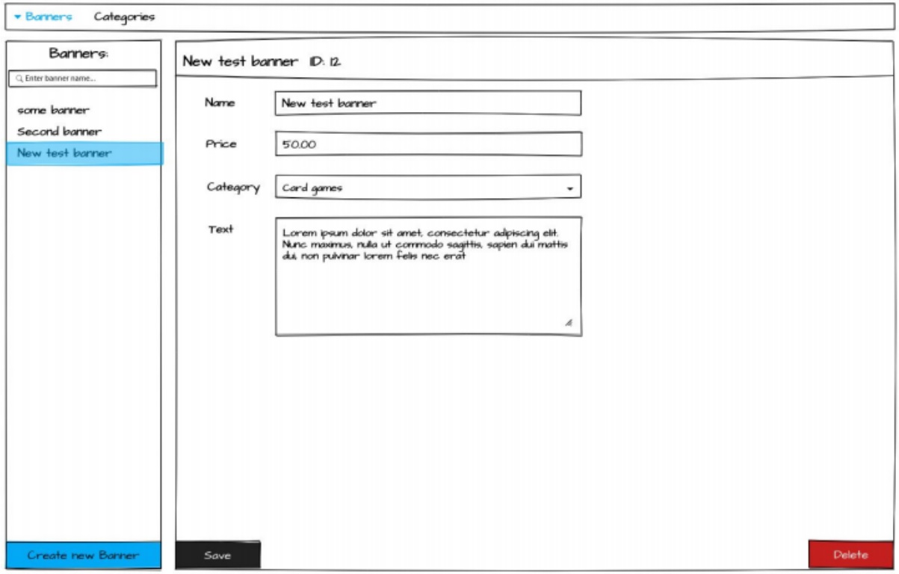

----

#### Макет создания баннера с сообщением ошибки валидации

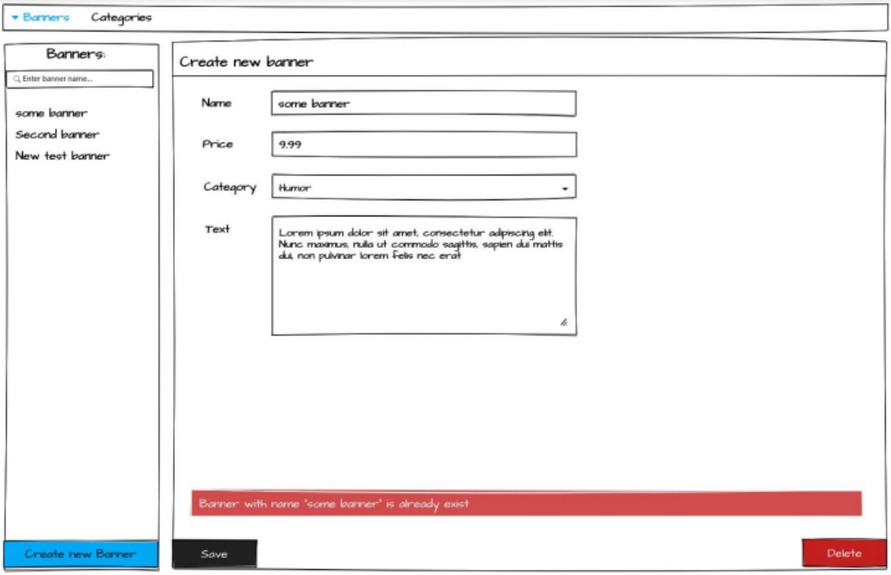

----

#### Макет редактирования категории

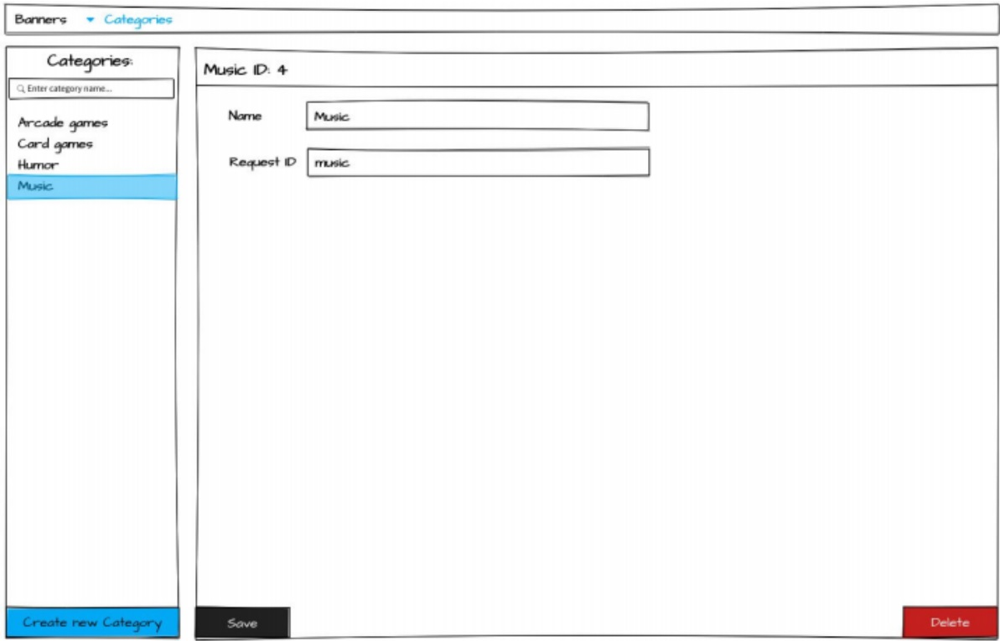

----

### Решение

#### Фронт

Файл страницы index.html содержит шаблон - общую стуктуру отображения данных, которая заполняется данными с помощью js.
Есть две переменные:
```javascript
        let frontendDataBanners = new Map()
        let frontendDataCategories = new Map()
```
которые содержат загруженные Баннеры и Категории. И отображение данных на странице происходит на основе их содержания:

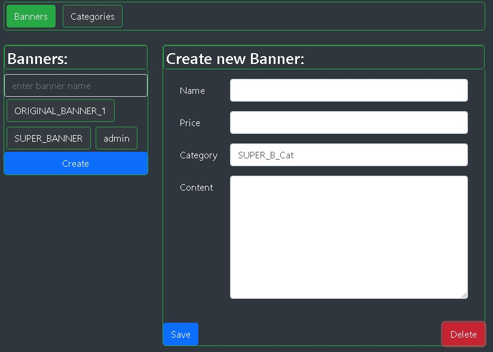

То есть, если я например хочу изменить баннер/категорию, то нажав на соответствущий элемент, я загружу его данные на страницу.
Данные будут пролучены из Map.

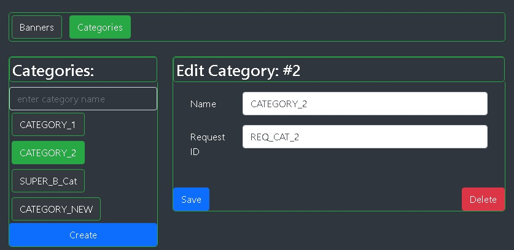

Если я решаю, что мне нужно создать новый баннер/категорию, то нажав на кнопку "Create", очищу форму и можно будет создать новый элемент:

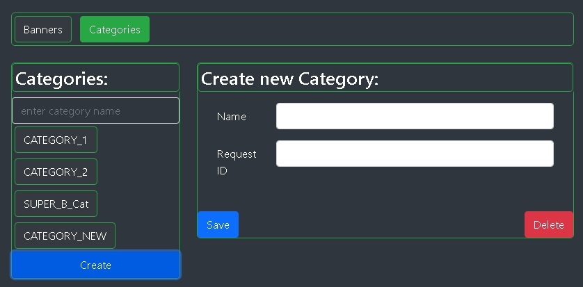

Есть валидация введенных данных как на стороне клиента, так и на стороне сервера. В случае ввода некорректных данных, информация об этом отобразится на странице:

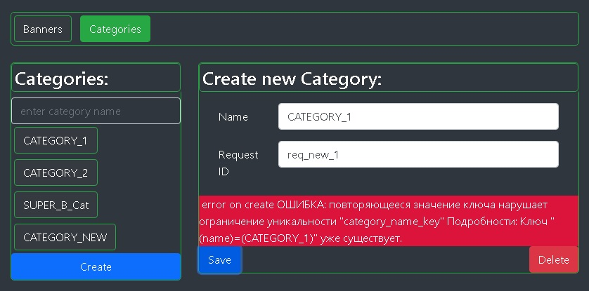

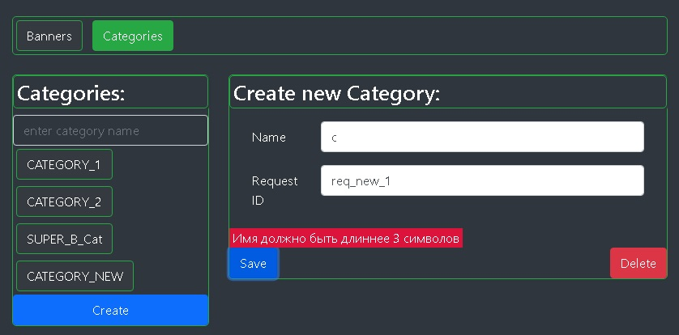

В случае успешного выполнения действия, данные Map обновятся, обновленные данные отобразятся на странице:

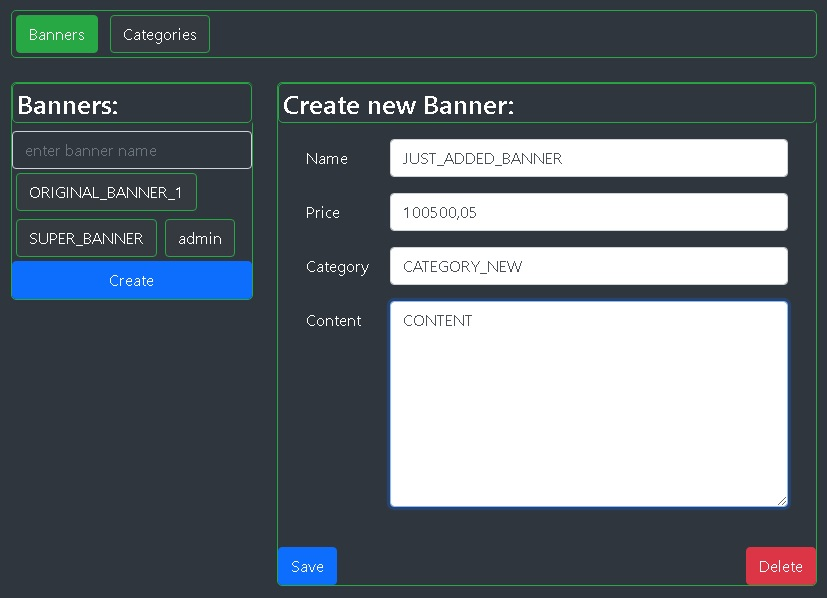

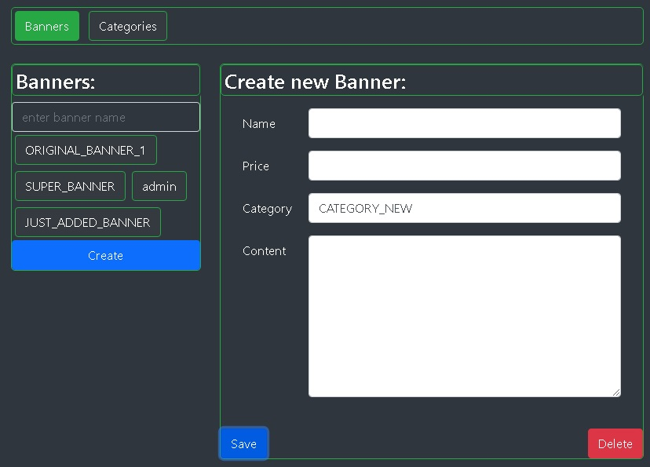

Получение и отправка данных (взаимодейтсвие с сервером в целом) основано на REST протоколе взаимодейтвия.
На стороне клиента это AJAX запросы (JQuery). На стороне сервера - Rest Controller. 

#### Бэк

#### Запуск проекта

Для запуска проекта нужен 
* Maven
* Postgres (на localhost:5432 должна быть доступна база данных jarsoft)
* Jdk (version 14 and later)

Из корня проекта делаем
```
mvn clean
mvn package
```
После BUILD SUCCESS из папки target можно запустить проект:
```
 java -jar jarsoft-0.1.war

  .   ____          _            __ _ _
 /\\ / ___'_ __ _ _(_)_ __  __ _ \ \ \ \
( ( )\___ | '_ | '_| | '_ \/ _` | \ \ \ \
 \\/  ___)| |_)| | | | | || (_| |  ) ) ) )
  '  |____| .__|_| |_|_| |_\__, | / / / /
 =========|_|==============|___/=/_/_/_/
 :: Spring Boot ::                (v2.4.4)

2021-04-05 18:34:14.599  INFO 7948 --- [           main] ru.gasevsky.jarsoft.Application          : Starting Application v0.1 using Java 14.0.1 on oot-gasevsky with PID 7948 
2021-04-05 18:34:14.605  INFO 7948 --- [           main] ru.gasevsky.jarsoft.Application          : No active profile set, falling back to default profiles: default
2021-04-05 18:34:24.035  INFO 7948 --- [           main] o.hibernate.annotations.common.Version   : HCANN000001: Hibernate Commons Annotations {5.1.2.Final}
///
// LOT OF
// SPRING LOGS
///
2021-04-05 18:34:27.152  INFO 7948 --- [           main] o.s.s.concurrent.ThreadPoolTaskExecutor  : Initializing ExecutorService 'applicationTaskExecutor'
2021-04-05 18:34:27.638  INFO 7948 --- [           main] o.s.b.w.embedded.tomcat.TomcatWebServer  : Tomcat started on port(s): 8085 (http) with context path ''
2021-04-05 18:34:27.658  INFO 7948 --- [           main] ru.gasevsky.jarsoft.Application          : Started Application in 14.186 seconds (JVM running for 15.173)
```

Проект запущен. Доступен на localhost:8085